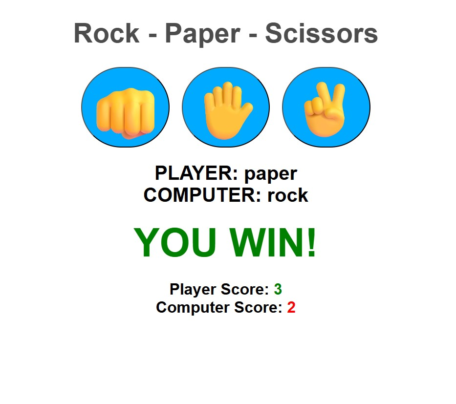

## 👊✋✌️ Rock-Paper-Scissors Game

Mini-game built with HTML, CSS and JavaScript.

## Preview

## Features

- Play against a random computer opponent
- Score tracking system
- Visual feedback for win/lose results
- Clean and minimal UI

## How to run:

- Clone the repository
- Open index.html in your browser

## How to play:

- Click one of the buttons: Rock (👊), Paper (✋), or Scissors (✌️)
- The computer will randomly choose its move
- The result will be displayed instantly
- Scores update automatically

## Technolohies:

- HTML
- CSS
- JavaScript
